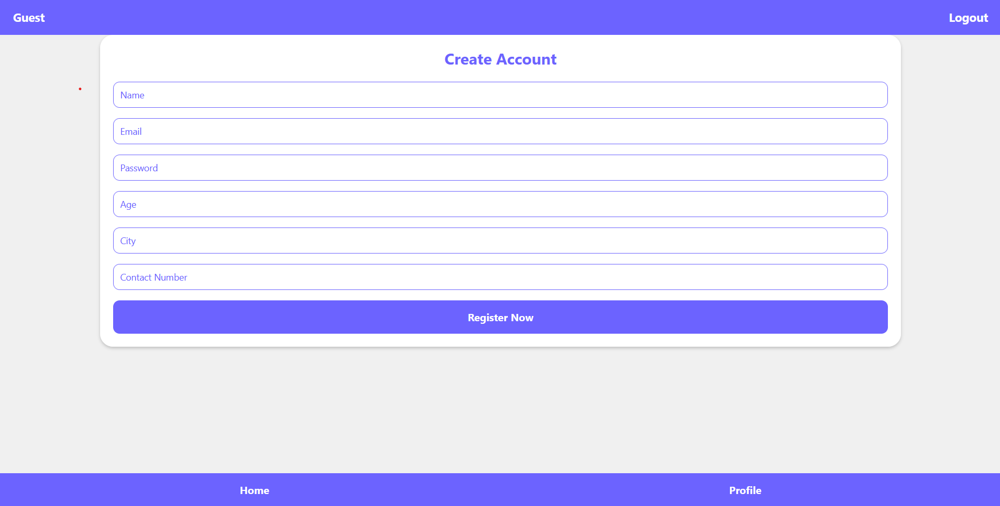
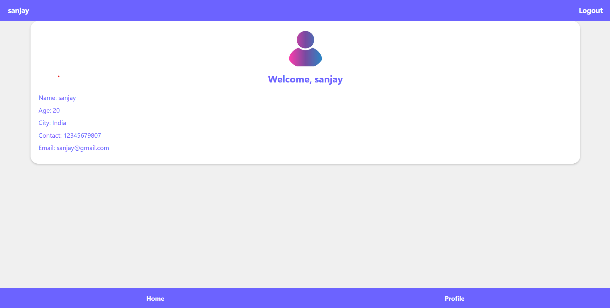
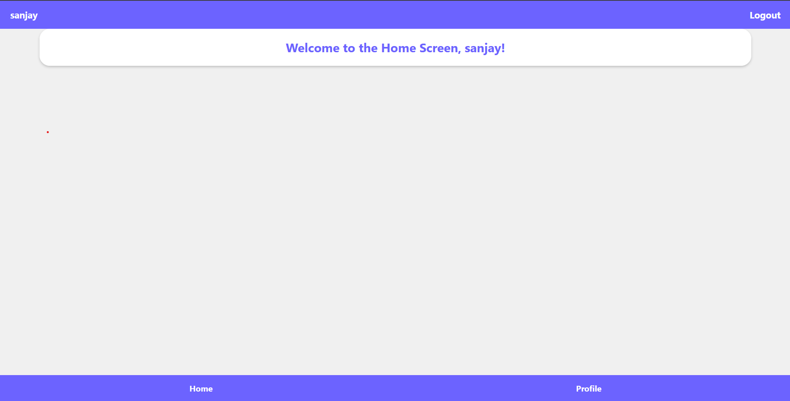
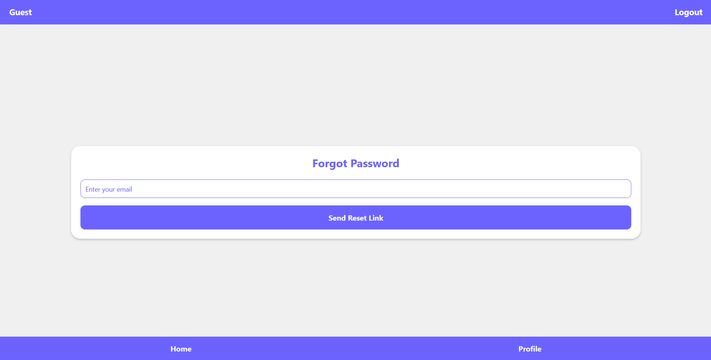

Login App

This is a simple React Native application that provides a seamless user experience for registration, login, and profile management. The app is designed to demonstrate a basic user interface and navigation system with modern UI styling, responsiveness, and core functionalities. Features

    User Registration

    Users can create an account by providing basic information such as: Name Email Password Age City Contact Number Input fields are validated to ensure required data is entered correctly.

    User Login

    Users can log in using their registered email and password. Error messages are displayed if the credentials are invalid.

    Forgot Password

    Users can request a password reset by providing their registered email address. A reset link or similar functionality is expected to be implemented on the server side.

    User Profile

    After logging in, users are redirected to their profile page, which displays: Name Age City Contact Number Email The profile page has a welcoming message with a user avatar and a modern, visually appealing design.

    Home Screen

    A dedicated home screen provides a welcoming message and can be expanded for further functionalities.

    Footer Navigation

    A persistent footer navigation bar allows users to easily switch between: Home Screen Profile Page The footer adapts seamlessly across the app.

    Header with Logout

    Each screen has a customized header that displays the logged-in user’s name. A Logout button in the header resets the session and redirects the user to the login screen.

Technologies Used

React Native: Frontend framework for building the application.
React Navigation: Navigation library for stack-based navigation and screen management.
React Hook Form: For handling form validations and user inputs.
Axios: For HTTP requests to the backend server.
AsyncStorage: To manage local data persistence (e.g., session storage).
Node.js: Backend runtime for the server.
Express.js: For creating the backend server API.
MongoDB: Database to store user information.

Directory Structure

src/ ├── components/ │ ├── Header.js # Custom header component │ ├── Footer.js # Footer navigation bar ├── screens/ │ ├── LoginScreen.js # Login page │ ├── SignupScreen.js # Registration page │ ├── ProfileScreen.js # User profile page │ ├── HomeScreen.js # Home screen │ ├── ForgotPasswordScreen.js # Password recovery screen ├── AppNavigator.js # App navigation setup server/ ├── server.js # Node.js Express server

Installation Prerequisites

Node.js and npm installed on your system.
MongoDB database (local or cloud).
React Native CLI for running the app.

Client-Side Setup

Clone the repository:

git clone cd

Install dependencies:

npm install

Start the Expo development server:

npx expo start

Once the Expo server is running:

For Android: Scan the QR code using the Expo Go app on your device.
For iOS: Open the Expo Go app on your iPhone and scan the QR code.
For Web: Press w in the terminal to open the app in your web browser.

    Server-Side Setup

    Navigate to the server directory:

cd server

Install dependencies:

npm install

Start the server:

node server.js

The server will run on http://localhost:5000. Ensure this matches the URL used in the client-side axios requests.

How to Run the App

Start the server:
    Make sure the server is running by navigating to the server directory and executing:

node server.js

Start the client:

Run the React Native app by navigating to the src directory and executing:

    npx expo start

Open the app on an emulator or physical device.

Screenshots

Login Screen

Signup Screen

Profile Screen

Home Screen

Forgot Password Screen

