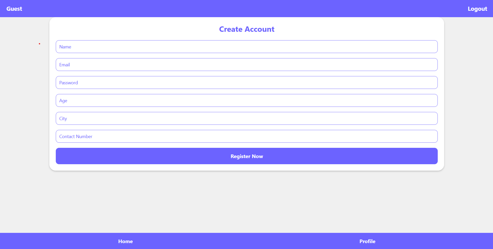
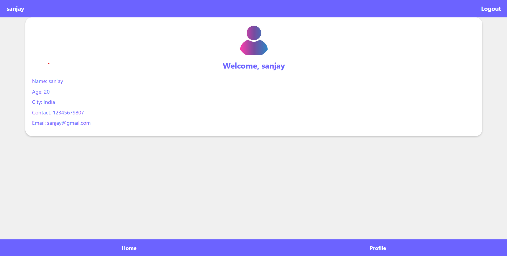
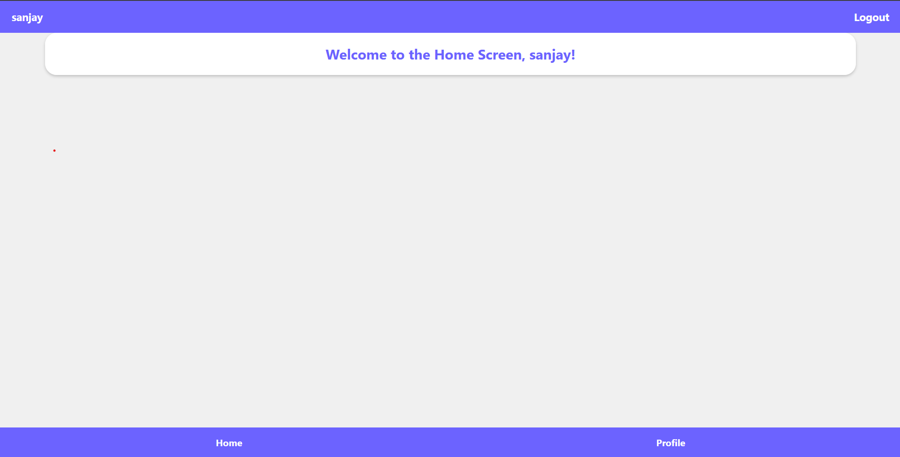
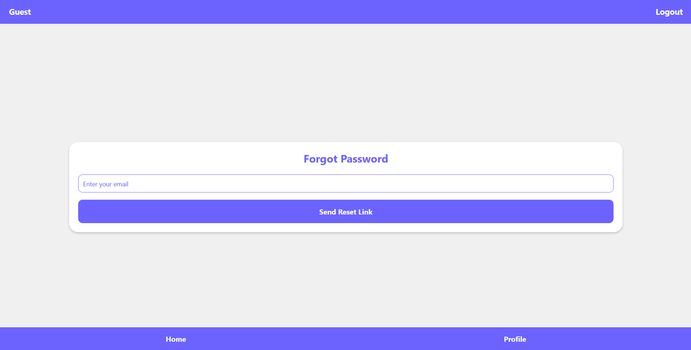
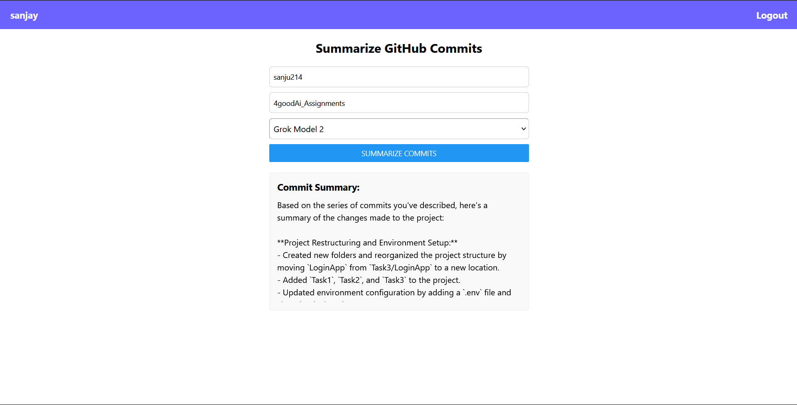

LoginApp

LoginApp is a full-stack application that provides a basic user authentication system. It features a backend built with Node.js and Express, a frontend built with React, and MongoDB as the database. The app allows users to register, log in, and view their profile information.
Features

    User Registration: Users can sign up with their name, email, password, age, city, and contact number.
    User Authentication: Secure login with password hashing using bcrypt.
    Profile Management: Users can view their profile information.
    Frontend Interface: A React-based user interface for interacting with the backend.
    MongoDB Integration: User data is stored in a MongoDB database.
    Dockerized Services: Fully containerized for seamless deployment.

Prerequisites

Ensure you have the following installed on your system:

    Docker
    Docker Compose

Project Structure

LoginApp/
├── backend/
│   ├── server/          # Backend server code
│   ├── data/            # MongoDB data folder (not tracked in Git)
│   └── .env             # Environment variables for the backend
├── frontend/            # React frontend code
├── docker-compose.yml   # Docker Compose configuration file
└── README.md            # Project documentation

Setup Instructions
Step 1: Clone the Repository

git clone <repository-url>
cd LoginApp

Step 2: Set Up Environment Variables

    Navigate to the backend directory and create a .env file.
    Add the following variables to the .env file:

NODE_ENV=development
MONGO_URI=mongodb+srv://<username>:<password>@<cluster-url>/<database>?retryWrites=true&w=majority

Replace <username>, <password>, <cluster-url>, and <database> with your MongoDB Atlas credentials.
Step 3: Build and Start Docker Containers

Run the following command in the root directory of the project:

docker-compose up --build

This will:

    Build the backend and frontend services.
    Set up the MongoDB database.
    Start the application.

Step 4: Access the Application

    Backend: Accessible at http://localhost:5000.
    Frontend: After running check it in an App called Expo in your android or iphone phone

Step 5: Test the Application

You can test the backend APIs using tools like curl or Postman.
Example: Register a User

curl -X POST http://localhost:5000/signup \
-H "Content-Type: application/json" \
-d '{"name":"John Doe","email":"john@example.com","password":"password123","age":30,"city":"New York","contact":"1234567890"}'

Example: Login a User

curl -X POST http://localhost:5000/login \
-H "Content-Type: application/json" \
-d '{"email":"john@example.com","password":"password123"}'

Docker Compose Configuration

The docker-compose.yml file defines three services:

    Backend: Runs the Express server.
        Mapped to http://localhost:5000.
        Environment variables are loaded from the .env file in the backend directory.

    Frontend: Runs the React application.
        Mapped to http://localhost:3000.

    Database (MongoDB):
        Exposes port 27017 for external connections.
        Stores data in the backend/data directory.

Notes

    Ensure that the backend/data folder is added to .gitignore to avoid tracking database data in Git.
    For production, consider using Docker secrets or a secure mechanism to store sensitive credentials like the MongoDB URI.

Troubleshooting

    Frontend Not Loading: Ensure that the React app is running by checking the logs of the loginapp-frontend container:

docker logs loginapp-frontend-1

Backend Not Connecting to MongoDB: Verify the MongoDB URI in the .env file and ensure the loginapp-db container is running.

docker ps

Database Data Persistence: If you want to retain MongoDB data across container restarts, ensure that the backend/data volume is not removed.

Screenshots

Login Screen

Signup Screen

Profile Screen

Home Screen

Forgot Password Screen

Github Commit Summarizer Screen

